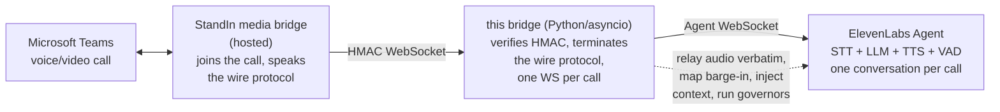
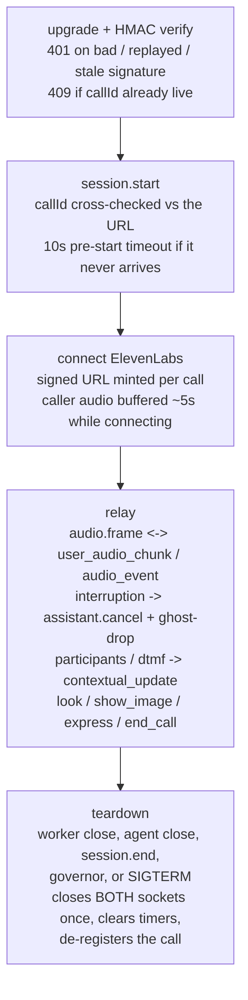

The bridge is a small, stateless-per-call relay. It holds two WebSockets per call - the StandIn media bridge on one side, an ElevenLabs Agent conversation on the other - and mostly copies bytes between them.

## System overview

The StandIn media bridge handles everything about Teams itself and exposes each call as a single WebSocket carrying `audio.frame` (PCM 16 kHz), `video.frame` (JPEG) and control messages. This bridge has no idea what is on the other end of the Teams call - it only speaks the wire protocol.

## The no-transcode property

Both sides speak base64 **PCM 16 kHz, 16-bit, mono**. The Teams side sends `audio.frame` payloads and ElevenLabs' `user_audio_chunk` / `audio_event` are the same `pcm_16000`, so the hot path is **copy-only**: no resampling, no re-encoding, nothing added to the latency budget beyond one relay hop. This is a hard contract - the bridge validates the agent's declared input/output format at call start and, on a mismatch, closes the agent socket and ends the call rather than run a whole call with garbled audio.

## Call lifecycle

Barge-in is handled by dropping any ElevenLabs `audio` event whose `event_id` is at or below the interrupted one, so stale agent audio never plays after the caller cuts in ("ghost drop").

## Source module map

| Module | Responsibility |
|---|---|
| `server.py` | aiohttp server + WS upgrade, HMAC validation, connection guards (caps, replay, pre-start, dup-callId 409), session registry, SIGTERM/SIGINT drain |
| `session.py` | One call: the StandIn WS ⇄ ElevenLabs WS relay, ghost-drop, governors, goodbye, client tools, speaker attribution, vision buffering |
| `elevenlabs.py` | ElevenLabs Agent socket, per-call signed-URL mint, standalone TTS for the goodbye, conversation-init builder, path-1 file upload |
| `protocol.py` | Wire message parsing (JSON, camelCase, discriminated on `type`) + PCM duration helper |
| `hmac_auth.py` | `HMAC-SHA256("{timestampMs}.{callId}")` sign/verify (constant-time), header names, freshness |
| `ssrf.py` | Public-URL guard for the agent-supplied `show_image` fetch (connect-time DNS rebind pinning) |
| `vision.py` | Path-2 describe-then-answer vision hook (OpenAI-compatible endpoint) |
| `config.py` | Env config, fail-loud numeric parsing, `EL_HOST` allowlist |
| `cli.py` | CLI entry point, `.env` loading, friendly startup errors |
| `metrics.py` | Prometheus counters served at `GET /metrics` |
| `log.py` | Minimal leveled logger |

## Trust and security model

| Layer | Protection |
|---|---|
| Upgrade auth | `HMAC-SHA256("{timestampMs}.{callId}")`, constant-time compare, fails closed when the secret is unset |
| Replay | Single-use `(callId, ts, sig)` guard within a 60 s freshness window |
| Duplicate call | A second live connection for the same `callId` is rejected (`409`) - no second billed conversation |
| DoS | Max connections (64), optional per-IP cap, 2 MB inbound frame cap, 1 MB outbound backpressure cap each way, 10 s pre-start timeout, WS heartbeat + 90 s idle watchdog |
| Key hygiene | `ELEVENLABS_API_KEY` is server-side only, never sent to the Teams side; `EL_HOST` is pinned to `*.elevenlabs.io` so the key cannot be exfiltrated to another host |
| SSRF | The agent-supplied `show_image` URL is resolved to public hosts only, no redirects, connect-time DNS re-checked against the same rules (rebind-proof), bounded time and size |
| Crash safety | Every handler is guarded so a single malformed frame or socket error cannot take other calls down |
| Shutdown | SIGTERM/SIGINT drains live calls (`session.end` + close) instead of hard-dropping them |
