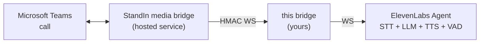

Welcome! **`elevenlabs-msteams-bridge`** (PyPI: [`elevenlabs-msteams-bridge`](https://pypi.org/project/elevenlabs-msteams-bridge/)) puts an [ElevenLabs Agent](https://elevenlabs.io/docs/eleven-agents/api-reference/eleven-agents/websocket) on a real **Microsoft Teams call**.

It is a small asyncio service (and importable Python library) that sits between two WebSockets:

The hosted **StandIn media bridge** ([standin.komaa.com](https://standin.komaa.com)) joins the Teams call and dials into your bridge, one authenticated WebSocket per call. The bridge opens one ElevenLabs Agent conversation per call and relays between them. Both sides speak base64 **PCM 16 kHz mono**, so audio is copied **verbatim** in both directions: no resampling, no re-encoding, nothing added to the latency budget beyond a relay hop.

:::note
This is the Python sibling of [`@komaa/elevenlabs-msteams-bridge`](https://github.com/komaa-com/elevenlabs-msteams-bridge) (Node.js). Same wire contract, same environment variables - the two are drop-in interchangeable behind the same `.env` file. The `-py` suffix is only in the repository name; the PyPI package is `elevenlabs-msteams-bridge`.
:::

## What it does

- **Realtime voice** - the caller talks to your ElevenLabs agent and hears it reply. Turn-taking, VAD and interruption are the agent's own; the bridge maps the caller's barge-in onto the Teams side and drops stale "ghost" audio so nothing plays after an interruption.
- **Per-call personalization** - caller name, tenant and direction as `dynamic_variables`; optional localized greeting or spoken AI disclosure; per-caller memory via `user_id` (guests never share an identity).
- **Vision on demand** - the agent's `look` client tool sees the caller's camera or screen-share: your own vision model (path 2) or ElevenLabs multimodal upload (path 1, recording-gated).
- **Agent client tools** - `end_call`, `express` (avatar emotion), `show_image` (image on the bot's tile, SSRF-guarded), `look`.
- **Two call governors** - StandIn-side tier cutoffs get a spoken goodbye; a bridge-side `MAX_CALL_MINUTES` hard cap protects your ElevenLabs budget.
- **Hardened transport** - replay-proof HMAC handshake, connection and payload caps, duplicate-call rejection, graceful SIGTERM drain, and an ElevenLabs host allowlist so your API key can never be sent elsewhere.

Use the sidebar to navigate. Start with **Getting Started**, or [run the example](/elevenlabs-msteams-bridge-py/example/) to see a full working setup, then jump to the **Configuration Reference** or **Library API**.
